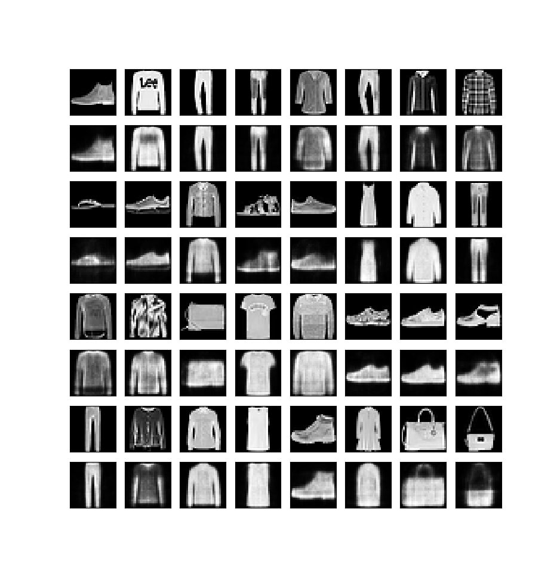

## Sparse Autoencoders

Sparsity constraint is imposed here by using a KL-Divergence penalty. See [this](https://web.stanford.edu/class/cs294a/sparseAutoencoder.pdf) for a detailed explanation of sparse autoencoders. 

The FashionMNIST dataset was used for this implementation. Figures shown below are obtained after 1 epoch:

### Using sparsity penalty:

### Normal autoencoder

